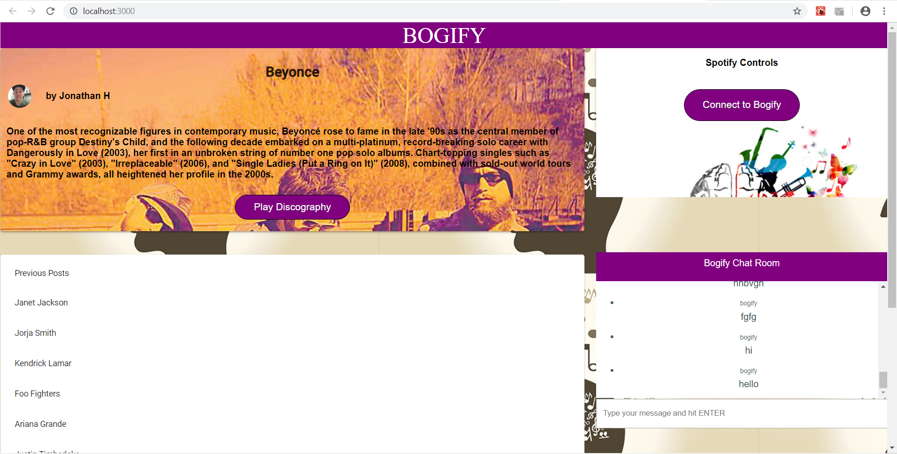

https://quiet-wave-99903.herokuapp.com/

# bogify_app

Bogify is a music app that lets the users select exisiting posts about different musicians, and the user can play their discography through Spotify. Users login using the Spotify Authorization. Users can shuffle the artists discography into their own playlists.

Bogify will create a playlist in that users profile according to which musician they choose.

# Demo

Please click the following link for a working version of Bogify

# Usage

npm install @material-ui/core
npm install cosmicjs
npm install spotify-web-api-js

# Languages Used

React
React Dom
React Scripts
Cosmic JS
ES 6

# API's Used

Spotify API
